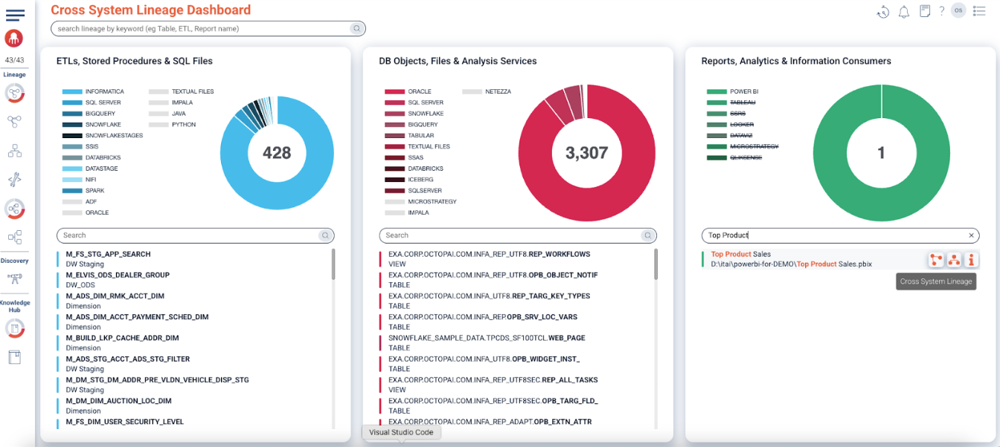
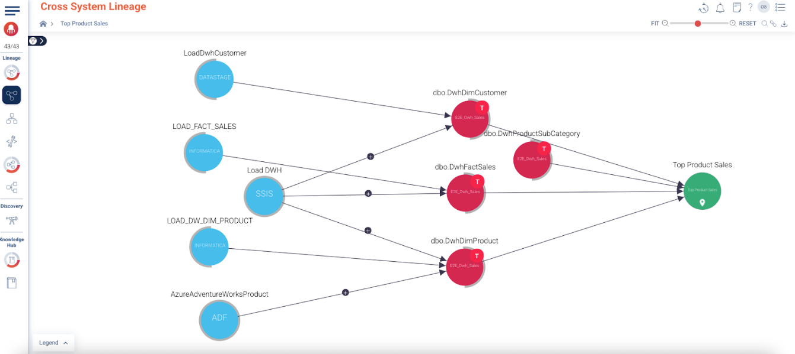
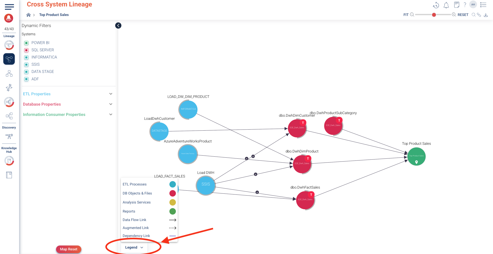

### Cross System Lineage

1. Your first step is to **search for the report titled "Top Product Sales"** in the *"Reports, Analytics & Information Consumers"* section of this dashboard. This will kickstart your investigation.

2. Upon hovering on the **"Top Product Sales"** report, click the icon titled **“Cross System Lineage”** to view its immediate lineage. You'll observe that the report receives data from **four key tables**:  
   - `dbo.DwhDimCustomer`  
   - `dbo.DwhProductSubCategory`  
   - `dbo.DwhFactSales`  
   - `dbo.DwhDimProduct`

   These tables, in turn, are populated by **five ETL processes**:  
   - **DATASTAGE** (`LoadDwhCustomer`)  
   - **INFORMATICA** (`LOAD_FACT_SALES` and `LOAD_DW_DIM_PRODUCT`)  
   - **SSIS** (`Load DWH`)  
   - **Azure Data Factory** (`AzureAdventureWorksProduct`)

3. Look at the bottom of the Cross System Lineage screen — you'll find the Legend dropdown. This panel acts as your visual key, helping you interpret the different node types and link styles in the lineage graph.

For example, what the legend explains here:
- Blue nodes = ETL processes (e.g., SSIS, Informatica, ADF)
- Red nodes = Database objects & files (e.g., SQL Server tables)
- Green nodes = Reports (e.g., Power BI reports like "Top Product Sales")

🔍 You can use this legend to quickly identify the role of each object in the lineage flow, especially when you're tracing how data moves across systems.

Now that you understand the legend, we’ll begin by exploring the Inner System Lineage views.
