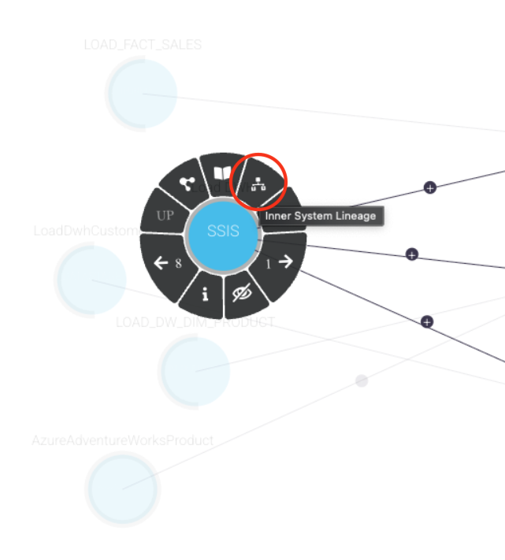
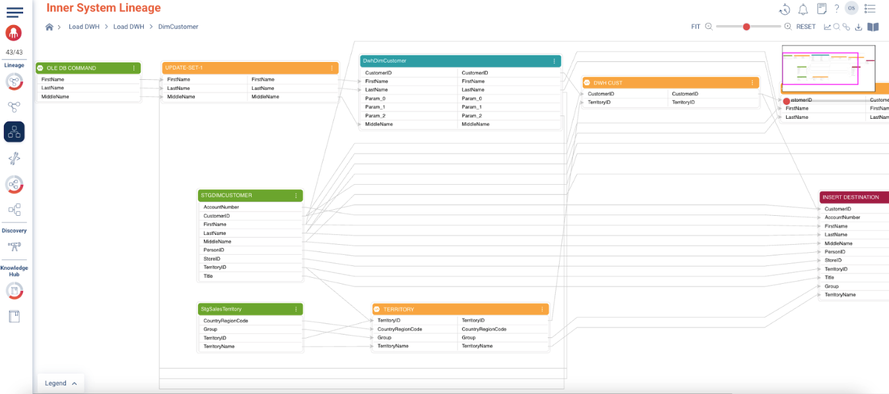
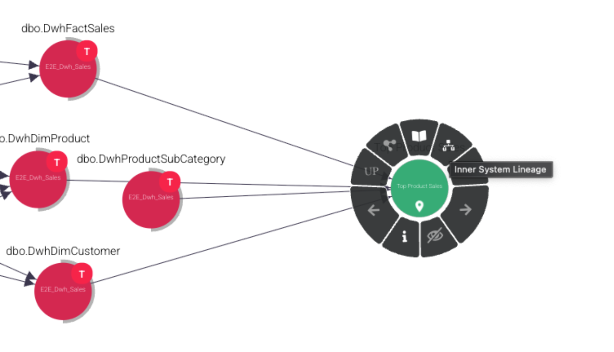

### Inner System Lineage

1. Now moving to the **Inner-System Lineage** view, we will drill down into **Load DWH SSIS** by clicking on it and selecting the “Inner System Lineage” icon.
2. The Sequence Container of the SSIS ETL will appear. Please note that this “Inner System Lineage” view is different for each type of ETL system/level to reflect its nature. For **SSIS (SQL Server Integration Services)**, it’s a sequence of tasks being executed in a specific order.
3. Click on the three dots of the Sequence Container and choose **“Container View”**.
4. Repeat the same with the **“Dim Customer”** task and choose **“Inner System Lineage”**.
5. Note how the view changed to reflect what transformations the task is doing, including sources and destinations.

6. Use your browser back button to go back to the Cross System Lineage view.
7. Show Inner System Lineage of the Report using the same steps explained before. Again, notice how the view is different for a report.

