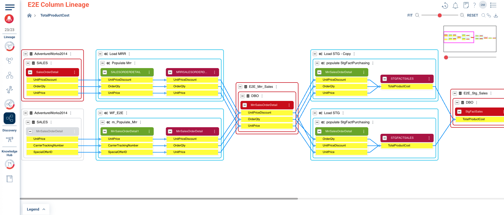
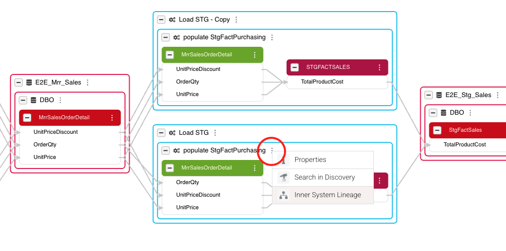

### End-to-End Column Lineage

Now is the time to start debugging the error our CEO is seeing in this report. We will achieve this by tracing the single `Total Product Cost` column back to how it was calculated.

1. Start by hovering on `TotalProductCost` in the `FactSales` table (coded in red) and clicking the three dots beside it. Once clicked, you will find its source fields highlighted in yellow.
2. Select **E2E Column Lineage**

In the E2E lineage view below, notice how it illustrates the end-to-end lineage for the `TotalProductCost` column. Starting from the original source tables in the `AdventureWorks2014` database, the data flows through two transformation stages (Informatica and SSIS), then passes through intermediate tables like `E2E_Mrr_Sales` and `STGFACTSALES`, undergoing further transformations until it finally populates the `TotalProductCost` column in the target staging area.

If you look closely at the middle light blue ETL processes, you will find that this is the first time where the `TotalProductCost` value was actually calculated using those three columns from `E2E_Mrr_Sales` table: `UnitProductDiscount`, `OrderQty` and `UnitPrice`. Let’s drill here further to understand the equation used in the calculation.

3. Find `Load STG` → `populate StgFactPurchasing` ETL, cick on the three dots associated with it, and select **Inner System Lineage**.

4. You will find the transformation coded in orange color and starting with the name “MRRSALESORDERS &....”. Click on its three dots and select **Properties**. Now you can see the exact SQL query that calculates the `TotalProductCost` column.

