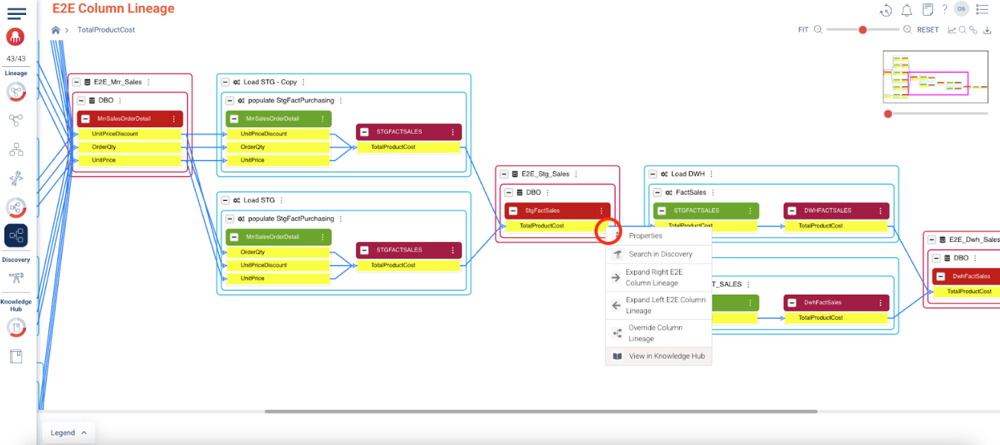
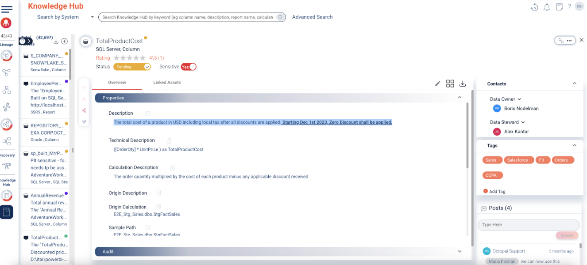

### Knowledge Hub

1. Using your browser back button, go back to the End-to-End view.
2. Click on the three dots beside TotalProductCost in the E2E_Stg_Sales table (coded in red)
3. Select **View in Knowledge Hub**

Welcome to the Octopai Knowledge Hub! This central interface allows quick and precise access to your data assets, enriched with essential business and technical context. Easily search across your data using keywords, asset names, or descriptions, and apply custom tags such as Sales, PII, or Orders for efficient data governance. Clearly define Data Owners and Stewards, and add detailed descriptions and calculations to maintain transparency and facilitate collaboration, enabling effective and compliant data management.

**NOTE** the discrepancy between the description shown here and the calculation logic we previously identified in the transformation query.
