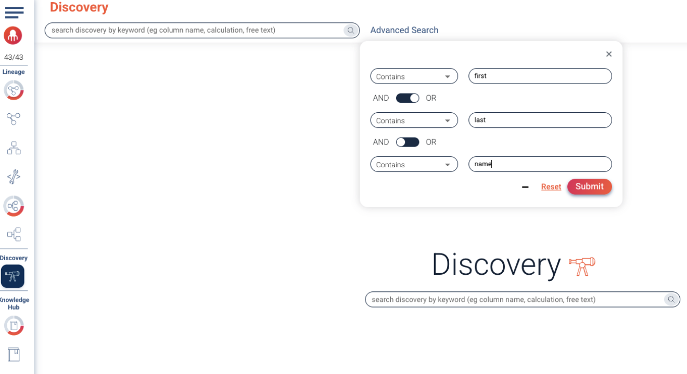
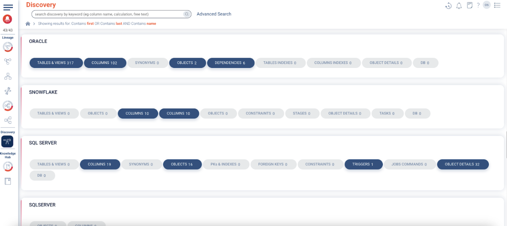

### Discovery Module

Now let’s switch to the Discovery Module where we can perform search through all our data assets using advanced criteria.

1. Click on the telescope icon under the title **“Discovery”** in the left icons menu.
2. Click **Advanced Search** on the right of the top search bar.
3. Enter search criteria & values as shown in the screenshot below. You can add the third criteria by clicking **Add Another Filter**. Don’t forget to switch to **AND** for the third criteria.
4. Click Submit. This will search for any asset across your data systems that contains **first** OR contains **last** AND contains **name**.

