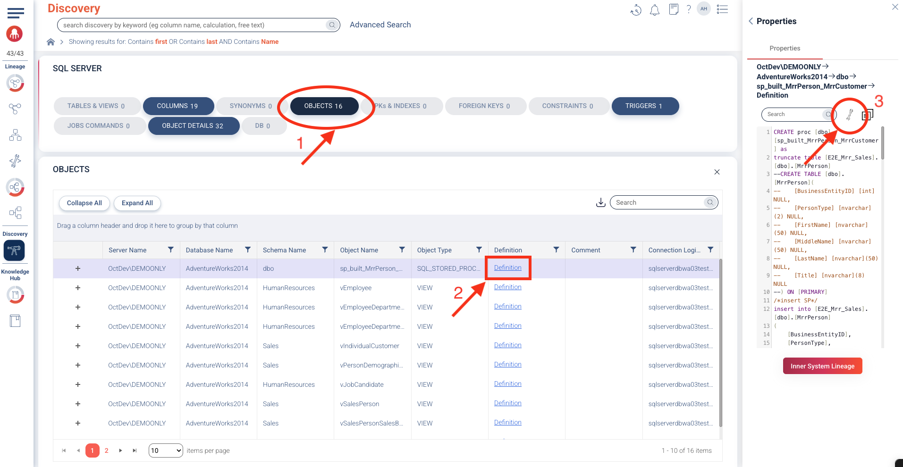
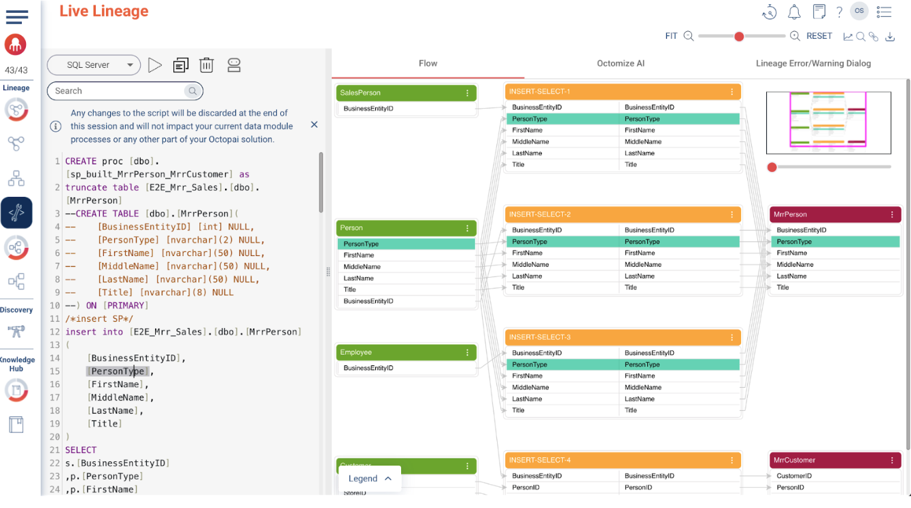

### Live Lineage

**The Live Lineage Visualizer** allows you to instantly see how relationships between database script objects change as you edit your SQL in real time. With this tool, you can:

- Parse and visualize any SQL script live to gain immediate insight into its sources, transformations, and targets.  
- Simulate the change in your SQL script before you go live to production.  
- Migrate a SQL script from one system to another by debugging your SQL script before migration.

#### To view Live Lineage:
1. Scroll down until you find **SQL Server** assets, then click **Objects** → `sp_built_MrrPerson_MrrCustomer` → **Definition** → **Edit in Live Lineage**

2. Try modifying the script before clicking on the play icon to inspect how the modifications will reflect in the right diagram (e.g. change FirstName to First_Name).
