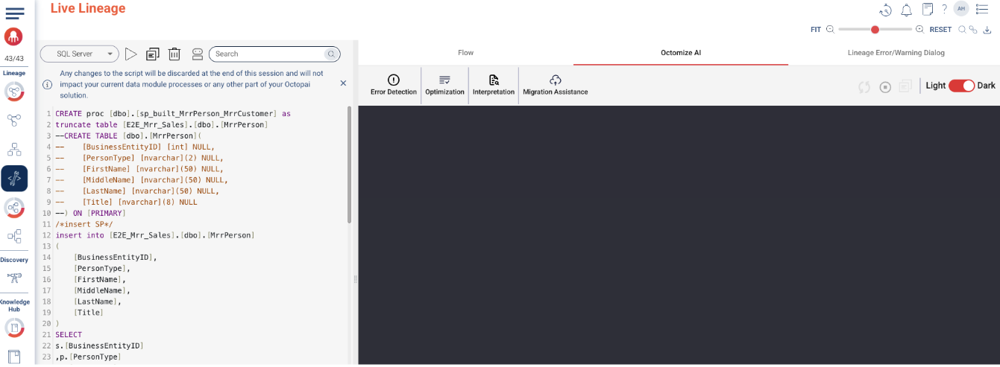
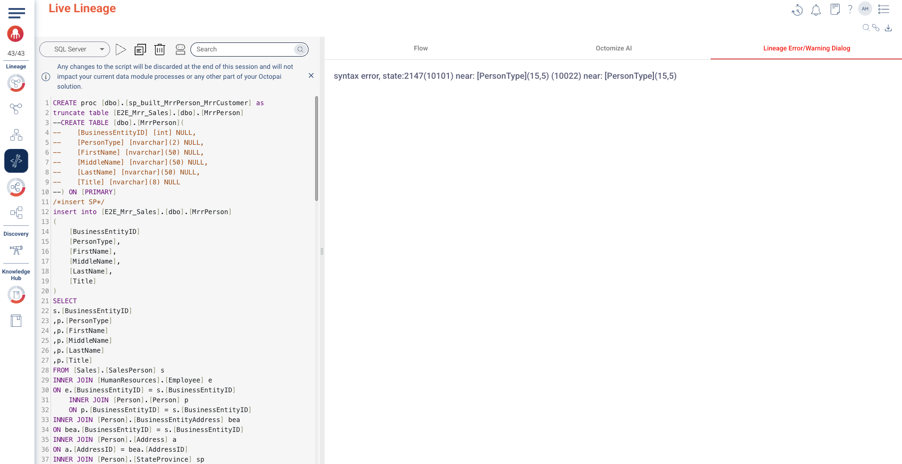

### Octomize AI

Octomize AI is Octopai’s enterprise-grade Generative AI (GenAI) assistant. It is specifically designed to enhance data lineage, governance, migration, and optimization processes within enterprise environments. Unlike general-purpose AI tools, Octomize AI operates within a private, secure infrastructure to meet the highest standards of data security, compliance, and performance for large-scale organizations.

1. Click on **Octomize AI** tab in the right side pane.  
2. Try breaking the script to test **Error Detection** in **Octomize AI** tab. You can also check how error is catptured in **Lineage Error/Warning Dialog** tab.  
3. Check out **Optimization, Interpretation and Migration Assistance features**.

